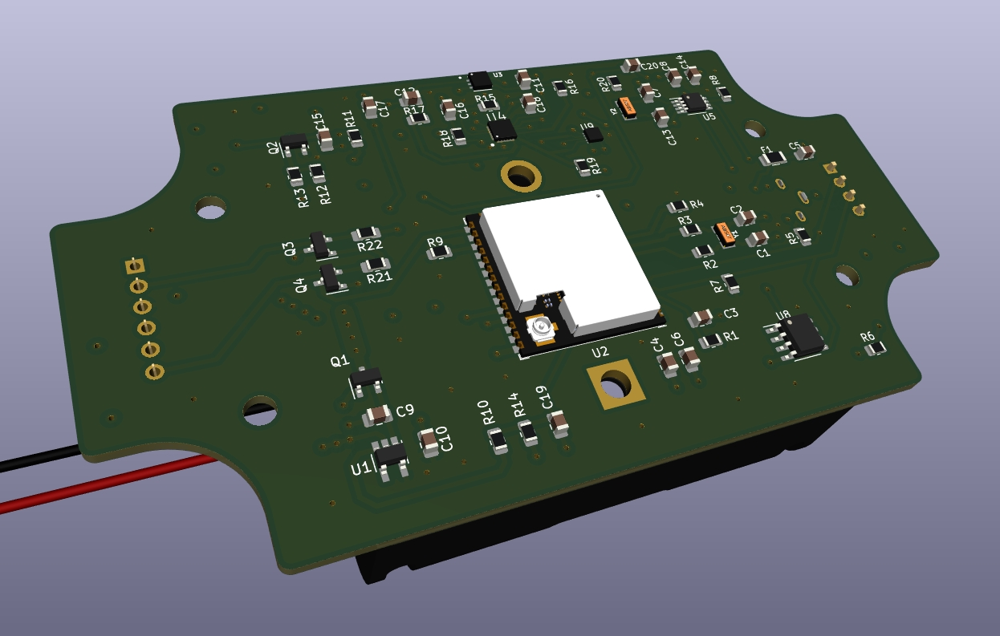

# Open-Source Water Meter Hardware Design




## Description

This repository contains the open-source hardware design files for a water meter. The design was created using KiCad 6.

## Features

- High-precision water metering
- Low power consumption
- Compact and cost-effective design
- Compatible with standard water metering infrastructure
- Customizable digital logic

## Details

Panalization command

```bash
	kikit panelize \
	--layout 'grid; rows: 2; cols: 2; space: 2mm' \
	--tabs 'fixed; width: 8mm; vcount: 2; hcount: 1'\
	--cuts 'mousebites; drill: 0.5mm; spacing: 1mm; offset: 0.2mm; prolong: 0.5mm'\
	--framing 'frame; width: 5mm; space: 3mm;'\
	--copperfill solid\
	--post 'millradius: 1mm;' water_meter.kicad_pcb panel.kicad_pcb
```

## License

This project is licensed under the CERN Open Hardware Licence Version 2 - Weakly Reciprocal. Please see the `LICENSE.txt` file for more details.